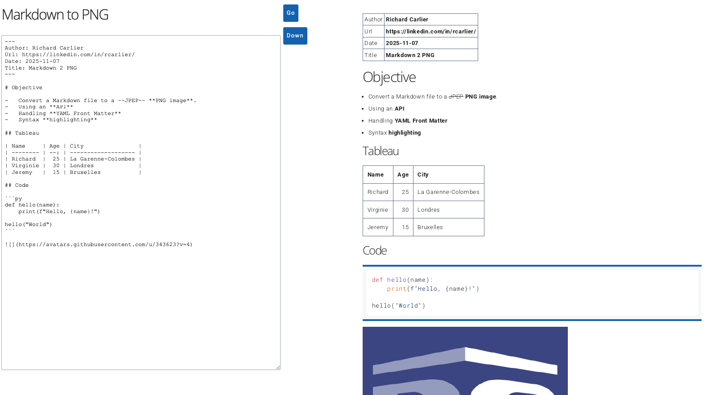

# Demo : image generated from mardown...

<p style="margin-left:100px"></p>

# Docker

```sh
# Après chaque modification
docker build -t md2png .
docker stop md2png-container
docker rm md2png-container
docker run -d -p 3000:3000 --name md2png-container md2png

# détruire
docker rm -f md2png-container

# logs
docker logs md2png-container
```

# Git

```sh
git add .
git commit -m ":sparkles: Some adj."
git push -u origin main
```

# Render

Vérifier le package.json

```json
  "scripts": {
    "start": "node app.js"
  }
```

Settings

-   create WebService
-   Git (public)
-   Settings : Auto-Deploy "OnCommit" (default)
